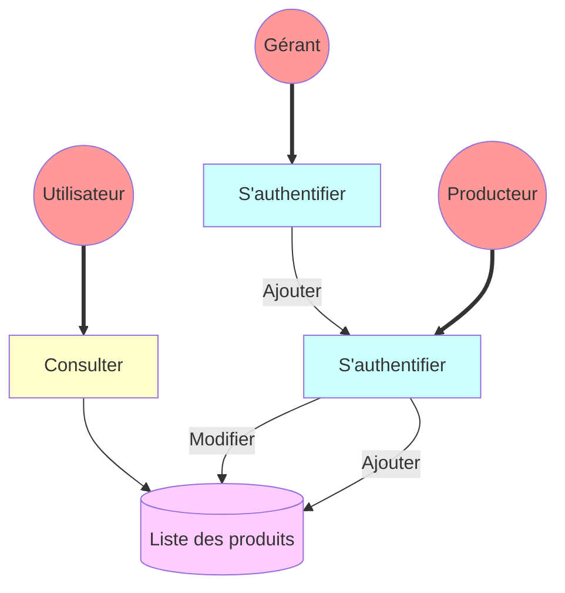

## leHangar.local

Un magasin coopératif de producteurs locaux souhaite développer une application de commandes 
en ligne. L'objectif est de permettre à ses usagers de passer commande en ligne et de venir chercher 
sur place la commande préparée.
Les produits vendus sont de différentes catégories : fruits et légumes, produits laitiers, épicerie, 
épicerie sucrée, pain et boulangerie, volaille, viande etc ...

